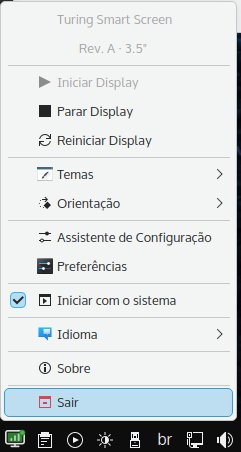

# Turing Smart Screen — Regata OS / openSUSE Edition

<p align="center">
  
</p>

<p align="center">
  <strong>Fork otimizado para Regata OS e openSUSE</strong><br/>
  Instalador automático · Aplicativo de bandeja · Suporte AMD GPU · Bilíngue (PT-BR / EN)
</p>

<p align="center">
  <a href="#instalação">Instalação</a> ·
  <a href="#funcionalidades">Funcionalidades</a> ·
  <a href="#comandos-úteis">Comandos</a> ·
  <a href="#english">English</a>
</p>

---
### Aplicativo de Bandeja (System Tray)

<p align="center">
  
</p>

O aplicativo de bandeja permite controlar totalmente o display diretamente pelo painel do sistema.
## Sobre

Este fork do [turing-smart-screen-python](https://github.com/mathoudebine/turing-smart-screen-python) adiciona suporte completo para **Regata OS** e **openSUSE**, incluindo:

- **Instalador automatizado** que configura tudo: dependências, venv, USB, systemd
- **Aplicativo de bandeja do sistema (system tray)** para KDE Plasma com controle completo
- **Serviço systemd** no nível de usuário para inicialização automática confiável
- **Detecção automática de GPU AMD** com instalação do `pyamdgpuinfo`
- **Interface bilíngue** — Português (BR) e English (US)

## Pré-requisitos

| Requisito | Detalhes |
|-----------|----------|
| **Sistema** | Regata OS / openSUSE Leap ou Tumbleweed |
| **Python** | 3.11 (`sudo zypper install python311`) |
| **Display** | Turing Smart Screen 3.5" / 5" / 7" conectado via USB |
| **Desktop** | KDE Plasma (recomendado) ou qualquer DE com suporte a system tray |

## Instalação

```bash
# 1. Clone o repositório
git clone https://github.com/marquimRcc/turing-smart-screen-python-regataos-opensuse
cd turing-smart-screen-python-regataos-opensuse

# 2. Execute o instalador
bash install.sh
```

O instalador irá:

1. Verificar pré-requisitos (OS, Python, espaço em disco)
2. Instalar dependências do sistema via `zypper`
3. Criar ambiente virtual Python 3.11
4. Instalar todas as dependências Python + PyQt5
5. Configurar regras udev para permissão USB
6. Instalar serviço systemd (nível de usuário)
7. Instalar o aplicativo de bandeja e ícone
8. Executar o assistente de configuração

## Funcionalidades

### Aplicativo de Bandeja (System Tray)

O ícone no painel do sistema oferece:

| Função | Descrição |
|--------|-----------|
| ▶ **Iniciar / ⏹ Parar / 🔄 Reiniciar** | Controle completo do display via systemd |
| 🎨 **Temas** | Troque o tema visualmente (lista automática dos temas disponíveis) |
| 🔄 **Orientação** | Alterne entre 0°, 90°, 180°, 270° |
| ⚙️ **Assistente de Configuração** | Abre o `configure.py` original |
| 📝 **Editar config.yaml** | Abre no editor padrão |
| 🔧 **Preferências** | Idioma, notificações, intervalo de verificação |
| 🚀 **Iniciar com o sistema** | Liga/desliga o autostart do serviço |
| 🌐 **Idioma** | Troque entre PT-BR e EN-US em tempo real |
| 🔍 **Info de Hardware** | GPU, sensores, dispositivos USB |
| 📋 **Ver Logs** | Logs do `journalctl` com busca e cópia |
| ❓ **Sobre / Suporte** | Links para GitHub e projeto original |

### Indicador de Status

O ícone muda de cor conforme o estado:

- 🟢 **Verde** — Display em execução
- ⚫ **Cinza** — Display parado
- 🔴 **Vermelho** — Erro

## Comandos Úteis

```bash
# Controle do display
systemctl --user start turing-screen      # Iniciar
systemctl --user stop turing-screen       # Parar
systemctl --user restart turing-screen    # Reiniciar
systemctl --user status turing-screen     # Status

# Autostart
systemctl --user enable turing-screen     # Ativar no boot
systemctl --user disable turing-screen    # Desativar

# Logs
journalctl --user -u turing-screen -f     # Logs em tempo real
journalctl --user -u turing-screen -n 50  # Últimas 50 linhas

# Reconfigurar
cd /caminho/do/repo && ./venv/bin/python3.11 configure.py

# Desinstalar
bash uninstall.sh
```

## Estrutura do Projeto

```
turing-smart-screen-python-regataos-opensuse/
├── main.py                     # (original) Programa principal do display
├── configure.py                # (original) Assistente de configuração
├── requirements.txt            # (original) Dependências Python
├── res/themes/                 # (original) Temas do display
│
├── install.sh                  # ★ Instalador automático
├── uninstall.sh                # ★ Desinstalador limpo
├── README.md                   # ★ Esta documentação
├── tray/                       # ★ Aplicativo de bandeja (PyQt5)
│   ├── main.py                 #   Ponto de entrada
│   ├── tray_app.py             #   Classe principal TuringTray
│   ├── service_manager.py      #   Interface com systemd
│   ├── config_manager.py       #   Gerenciamento de configuração
│   ├── dialogs/                #   Janelas de diálogo
│   │   ├── about.py, settings.py, hardware_info.py, log_viewer.py
│   └── i18n/                   #   Traduções
│       ├── pt_BR.json, en_US.json
├── assets/icons/               # ★ Ícones SVG do tray
├── config/                     # ★ Regras udev pro USB
├── desktop/                    # ★ Templates .desktop (autostart + menu)
└── systemd/                    # ★ Template do serviço de usuário
```

> Itens marcados com ★ são adições deste fork.

## Solução de Problemas

**Display não inicia:**
1. Verifique a conexão USB: `lsusb | grep -i ch34`
2. Verifique permissões: `ls -la /dev/ttyUSB*`
3. Verifique se fez logout/login após a instalação
4. Veja os logs: `journalctl --user -u turing-screen -n 20`

**Tray não aparece:**
1. Verifique se o KDE tem suporte a system tray
2. Execute manualmente: `~/caminho/repo/venv/bin/python3.11 ~/caminho/repo/tray/main.py`

**GPU AMD não detectada:**
- Verifique drivers: `lspci -k | grep -A 2 -i vga`
- Instale manualmente: `./venv/bin/pip install pyamdgpuinfo`

## Contribuindo

Contribuições são bem-vindas! Abra uma issue ou pull request.

## Créditos

- **Projeto original:** [turing-smart-screen-python](https://github.com/mathoudebine/turing-smart-screen-python) por Mathieu Houdebine
- **Fork Regata OS:** [marquimRcc](https://github.com/marquimRcc)

---

<a name="english"></a>

## 🇺🇸 English

### Quick Install

```bash
git clone https://github.com/marquimRcc/turing-smart-screen-python-regataos-opensuse
cd turing-smart-screen-python-regataos-opensuse
bash install.sh
```

### What's Added

This fork adds Regata OS / openSUSE support: automated installer, PyQt5 system tray app, systemd user service, AMD GPU detection, and bilingual interface (PT-BR / EN-US). See the Portuguese sections above for full documentation.

### Uninstall

```bash
bash uninstall.sh
```

---

**Licença / License:** GPL-3.0 (mesma do projeto original)
